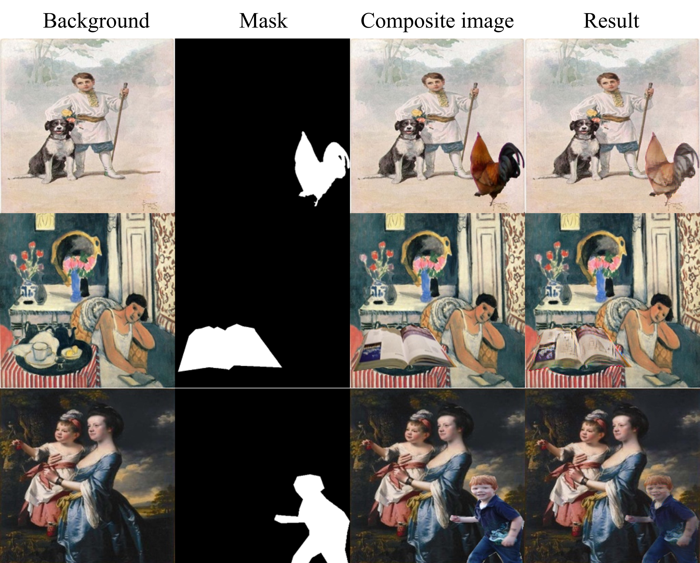

# ArtoPIH-Painterly-Image-Harmonization

We release the dataset and code used in the following paper:
> **Painterly Image Harmonization by Learning from Painterly Objects**  [[arXiv]](https://arxiv.org/pdf/2312.10263.pdf)<br>
>
> Li Niu, Junyan Cao, Yan Hong, Liqing Zhang
>
> Accepted by AAAI 2024


**For painterly image harmonization, it is hard to provide pixel-wise supervision based on pairs of painterly images and photographic images. Nevertheless, we can provide style-level supervision based on pairs of painterly objects and photographic objects.** Our harmonization results can better maintain the intrinsic information of foreground object and have closer style to painterly objects. 

## Artistic-Object-Dataset-Arto

Our Arto dataset contains 33,294 artistic/painterly objects in artistic images with accurate object masks. Each painterly object is associated with a set of similar photographic objects.


### Painterly Objects
First, we use off-the-shelf [object detection model](https://github.com/facebookresearch/detectron2) to detect the objects in artistic images from WikiArt training set. We use [segment anything model](https://segment-anything.com/demo) and manual refinement to get accurate masks of painterly objects. We obtain 33,294 painterly objects with accurate object masks. We release the artistic images in WikiArt [[Baidu Cloud](https://pan.baidu.com/s/192pGtJeMzj5VqTDjH6DUXg) (access code: sc0c), [Dropbox](https://www.dropbox.com/scl/fo/9iqa8772hwlgu18vr92et/ABh2Dwgizgc-xhycKDGeaZA?rlkey=6tdv6cqe0zaeteetw23kb2hjz&st=bnn9jxwa&dl=0)] and the painterly object masks [[Baidu Cloud](https://pan.baidu.com/s/1VacWN_5FgOXnzd2q9cIyYA) (access code: ait8), [Dropbox](https://www.dropbox.com/scl/fi/1ukcdiky8p4z31nf85llh/wikiart_object_mask.zip?rlkey=eres1hlp5iazt77v0tq8v18im&st=9c36augc&dl=0)]. Painterly object mask is named `<painterly-image-name>_<id>.png`, indicating the painterly object in the artistic image.


### Similar Photographic Objects

Then, we train an object retrieval model (see the supplementary in [[arXiv]](https://arxiv.org/pdf/2312.10263.pdf)) to retrieve similar photographic objects for each painterly object. Specifically, provided with one painterly object, we retrieve 100 nearest photographic objects from COCO 2014 training set, which have similar color and semantics with the given painterly object. However, the retrieved results are very noisy, so we ask annotators to manually remove those dissimilar photographic objects. Each painterly object has an average of 9.83 similar photographic objects. 


We release all the photographic objects with object masks in [Baidu Cloud](https://pan.baidu.com/s/1x3xqoNvKOdocSjRHFq-pJA) (access code: 3ujl) or [Dropbox](https://www.dropbox.com/scl/fi/jb4gtzat0rjh2a0vqcf7l/photographic_object.zip?rlkey=ngjfqu2qavi6p9x4byeldqw6l&st=zr7pl0wi&dl=0). Note that the photographic objects are cropped from the original photographic images based on the bounding boxes.  Photographic object image is named `<photographic-image-name>_<id>.jpg` and its object mask is named `<photographic-image-name>_<id>.png`. For each painterly object, we provide a similar object list named `<painterly-image-name>_<id>.txt` which records its similar photographic objects. Each line in the list records the information of one similar photographic object. We release the similar object lists in [Baidu Cloud](https://pan.baidu.com/s/1G0L1uX13_zEFx4Lkf-3bjA) (access code: h9n4) or [Dropbox](https://www.dropbox.com/scl/fi/w79l0av9ef6dyzcsbwz0a/similar_objects_train_released.zip?rlkey=w1x5aexil3xdmalbbdroqgz1u&st=vakugw0g&dl=0).

### Examples

An example is shown below. The painterly object in the leftmost column is outlined in yellow. The rest of columns are similar photographic objects. 


In the painterly object name `Art_Nouveau_Modern/andrei-ryabushkin_moscow-street-of-xvii-century_0`, `Art_Nouveau_Modern/andrei-ryabushkin_moscow-street-of-xvii-century` is the name of the painterly image where the painterly object belongs to, and `0` is the annotation id.
The similar object list is  `Art_Nouveau_Modern/andrei-ryabushkin_moscow-street-of-xvii-century_0.txt`. In this list, each line records the information of a similar photographic object. From left to right are: painterly object name, category id and name, similar photographic object name. In the photographic object name `COCO_train2014_000000021830_481814`, `COCO_train2014_000000021830` is the name of the photographic image where the photographic object belongs to, and `481814` is the annotation id.

We provide more example pairs of painterly objects and photographic objects below.


### Dataset Statistics

The distribution of painterly object categories:


The distribution of the number of similar photographic objects for each painterly object:


## Prerequisites
- Linux
- Python 3.9
- PyTorch 1.10
- NVIDIA GPU + CUDA

## Getting Started
### Installation
- Clone this repo:

```bash
git clone https://github.com/bcmi/ArtoPIH-Painterly-Image-Harmonization.git
```

- Download the datasets and put them in the corresponding foldes in `./datasets`. 

- Install PyTorch and dependencies:

  ```bash
  conda create -n ProPIH python=3.9
  conda install pytorch==1.10.1 torchvision==0.11.2 torchaudio==0.10.1 cudatoolkit=11.3 -c pytorch -c conda-forge
  ```

- Install python requirements:

```bash
pip install -r requirements.txt
```

- Download pre-trained VGG19 from [Baidu Cloud](https://pan.baidu.com/s/1HljOE-4Q2yUeeWmteu0nNA) (access code: pc9y) or [Dropbox](https://www.dropbox.com/scl/fi/1r04z7ha2b0a8yi3qt361/vgg_normalised.pth?rlkey=vl1j01j97focvzymjehjn5qxv&st=ft26kbdh&dl=0). Put it in  `./<checkpoints_dir>/pretrained`.

### ArtoPIH train/test
- Train ArtoPIH:

Modify the `content_dir`, `style_dir`, and `info_dir` to the corresponding path of each dataset in `train.sh`.

```bash
cd scripts
bash train.sh
```

The trained model would be saved in `./<checkpoints_dir>/<name>/`. If you want to load a model and resume training, add `--continue_train` and set the `--epoch XX` in `train.sh`. It would load the model `./<checkpoints_dir>/<name>/<epoch>_net_G.pth`.
For example, if the model is saved in `./AA/BB/latest_net_G.pth`, the `checkpoints_dir` should be `../AA/`, the `name` should be `BB`, and the `epoch` should be `latest`.

- Test ArtoPIH:

Our pre-trained model is available on [Baidu Cloud](https://pan.baidu.com/s/1deD2-dnK_Prs9Q-2dPIEZg) (access code: io7s) or [Dropbox](https://www.dropbox.com/scl/fi/5nmyg94x0tneazim7znrc/latest_net_G.pth?rlkey=931a5jhlr8zckzeqwfjc07nc7&st=1wi4yb1y&dl=0). Put it in `./<checkpoints_dir>/pretrained`. We provide some test examples in `./examples`. 

```bash
cd scripts
bash test.sh
```

The output results would be saved in `./output`. We provide some results below.

<div align="center">
	
</div>

## Other Resources

+ [Awesome-Image-Harmonization](https://github.com/bcmi/Awesome-Image-Harmonization)
+ [Awesome-Image-Composition](https://github.com/bcmi/Awesome-Object-Insertion)
